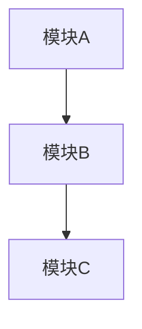
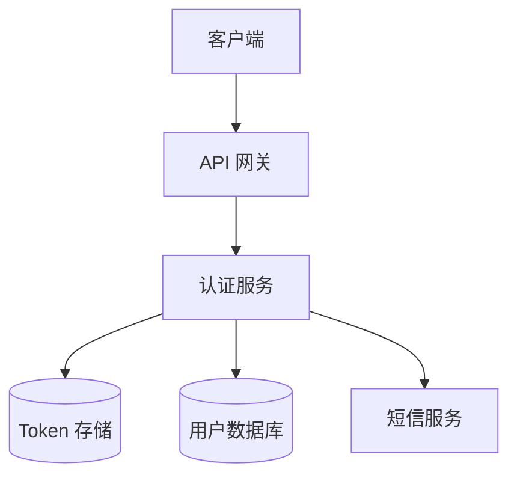

# tech-design-doc Skill 实现计划

> **For Claude:** REQUIRED SUB-SKILL: Use superpowers:executing-plans to implement this plan task-by-task.

**Goal:** 创建一个完整的技术设计文档 Skill，涵盖 SKILL.md、scripts、references、assets 所有组件

**Architecture:** 使用标准 Skill 目录结构，通过引导式问答生成技术设计文档，包含验证脚本和参考资料

**Tech Stack:** Markdown, Python 3, Skill 框架

---

## Task 1: 创建 Skill 目录结构

**Files:**
- Create: `tech-design-doc/SKILL.md`
- Create: `tech-design-doc/scripts/` (directory)
- Create: `tech-design-doc/references/` (directory)
- Create: `tech-design-doc/assets/` (directory)

**Step 1: 创建目录结构**

Run:
```bash
mkdir -p tech-design-doc/scripts tech-design-doc/references tech-design-doc/assets
```

**Step 2: 验证目录创建成功**

Run:
```bash
ls -la tech-design-doc/
```

Expected: 显示 scripts、references、assets 三个目录

**Step 3: 提交目录结构**

```bash
git init tech-design-doc
cd tech-design-doc
git add .
git commit -m "chore: init skill directory structure"
```

---

## Task 2: 编写 SKILL.md

**Files:**
- Create: `tech-design-doc/SKILL.md`

**Step 1: 创建 SKILL.md 文件**

```markdown
---
name: tech-design-doc
description: 技术设计文档生成工具。用于：(1) 新功能开发前的方案设计 (2) 通过引导式提问生成完整设计文档 (3) 输出 Markdown 格式。当用户说"写设计文档"、"TDD"、"技术方案"时触发。
---

# 技术设计文档生成器

## 工作流程

1. **了解背景** - 询问要解决什么问题、目标用户、预期收益
2. **设计方案** - 引导设计架构、技术选型、核心流程
3. **定义接口** - 确定 API 接口、数据结构、错误处理
4. **规划实现** - 拆分里程碑和任务、标注风险依赖
5. **生成文档** - 基于模板输出完整 Markdown 文档

## 引导问题清单

### 背景章节
- 你要解决什么问题？当前的痛点是什么？
- 目标用户是谁？
- 成功的标准是什么？

### 方案设计章节
- 整体架构是怎样的？涉及哪些模块？
- 核心流程是什么？
- 为什么选择这个技术方案？有哪些备选？

### 接口定义章节
- 需要哪些 API 接口？
- 数据结构是怎样的？
- 如何处理错误情况？

### 实现计划章节
- 可以分成哪几个里程碑？
- 每个任务大概需要多长时间？
- 有什么风险或依赖？

## 资源

- **写作指南**: 各章节详细写作要点见 `references/writing-guide.md`
- **自检清单**: 完成后用 `references/checklist.md` 检查
- **文档模板**: 使用 `assets/template.md` 作为基础
- **完整示例**: 参考 `assets/example.md` 了解实际写法

## 验证

生成文档后，运行验证脚本检查完整性：

```bash
python scripts/validate_doc.py <文档路径>
```

如果提示缺少章节，根据提示补充。
```

**Step 2: 验证文件内容**

Run:
```bash
head -20 tech-design-doc/SKILL.md
```

Expected: 显示 frontmatter 和标题

**Step 3: 提交 SKILL.md**

```bash
git add tech-design-doc/SKILL.md
git commit -m "feat: add SKILL.md with workflow and questions"
```

---

## Task 3: 编写验证脚本

**Files:**
- Create: `tech-design-doc/scripts/validate_doc.py`

**Step 1: 创建 validate_doc.py**

```python
#!/usr/bin/env python3
"""检查技术设计文档的完整性"""

import sys
import re

REQUIRED_SECTIONS = [
    "背景",
    "方案设计",
    "接口定义",
    "实现计划"
]

def validate(filepath: str) -> list[str]:
    """验证文档，返回缺失的章节列表"""
    try:
        with open(filepath, 'r', encoding='utf-8') as f:
            content = f.read()
    except FileNotFoundError:
        print(f"错误：文件不存在 - {filepath}")
        sys.exit(2)
    except Exception as e:
        print(f"错误：无法读取文件 - {e}")
        sys.exit(2)

    missing = []
    for section in REQUIRED_SECTIONS:
        # 匹配 ## 背景 或 ## 1. 背景 或 ## 一、背景 等格式
        pattern = rf'^##\s*(\d+\.|\S、)?\s*{section}'
        if not re.search(pattern, content, re.MULTILINE):
            missing.append(section)

    return missing

def main():
    if len(sys.argv) != 2:
        print("用法: python validate_doc.py <文档路径>")
        print("示例: python validate_doc.py my-feature-design.md")
        sys.exit(1)

    filepath = sys.argv[1]
    missing = validate(filepath)

    if missing:
        print(f"❌ 文档不完整，缺少以下章节：")
        for section in missing:
            print(f"   - {section}")
        sys.exit(1)
    else:
        print("✅ 文档结构完整，包含所有必需章节")
        sys.exit(0)

if __name__ == "__main__":
    main()
```

**Step 2: 添加执行权限**

Run:
```bash
chmod +x tech-design-doc/scripts/validate_doc.py
```

**Step 3: 创建测试文档（用于验证脚本）**

创建临时测试文件 `/tmp/test_doc_complete.md`:

```markdown
# 测试文档

## 背景
测试内容

## 方案设计
测试内容

## 接口定义
测试内容

## 实现计划
测试内容
```

**Step 4: 测试脚本 - 完整文档**

Run:
```bash
python tech-design-doc/scripts/validate_doc.py /tmp/test_doc_complete.md
```

Expected: `✅ 文档结构完整，包含所有必需章节`

**Step 5: 创建不完整测试文档**

创建 `/tmp/test_doc_incomplete.md`:

```markdown
# 测试文档

## 背景
测试内容
```

**Step 6: 测试脚本 - 不完整文档**

Run:
```bash
python tech-design-doc/scripts/validate_doc.py /tmp/test_doc_incomplete.md
```

Expected: `❌ 文档不完整，缺少以下章节：` 并列出缺失章节

**Step 7: 清理测试文件并提交**

```bash
rm /tmp/test_doc_complete.md /tmp/test_doc_incomplete.md
git add tech-design-doc/scripts/validate_doc.py
git commit -m "feat: add document validation script"
```

---

## Task 4: 编写 references/writing-guide.md

**Files:**
- Create: `tech-design-doc/references/writing-guide.md`

**Step 1: 创建 writing-guide.md**

```markdown
# 技术设计文档写作指南

## 各章节写作要点

### 背景
- 用 1-2 段说明要解决的问题
- 包含：现状痛点、目标用户、预期收益
- 避免：过早涉及技术细节

**好的例子：**
> 当前用户登录需要每次输入手机号和验证码，日均登录次数 5000+，用户反馈体验繁琐。本次优化目标是支持"记住登录"功能，减少 80% 的重复登录操作。

**不好的例子：**
> 我们要用 JWT + Redis 实现登录优化。（过早涉及技术细节）

### 方案设计
- 先画大图，再细化
- 说明"为什么选这个方案"，不只是"是什么"
- 如有备选方案，简要说明为何不选

**建议包含：**
1. 架构图（使用 Mermaid 语法）
2. 核心流程描述
3. 技术选型表格（组件、选择、理由）

### 接口定义
- API 使用代码块展示
- 包含：请求/响应示例、错误码说明
- 数据结构用表格或 JSON Schema

**API 格式示例：**
```
**接口名称**
- 路径：POST /api/xxx
- 描述：功能描述

请求：{ JSON }
响应：{ JSON }
错误码：列表
```

### 实现计划
- 按里程碑拆分，每个 1-2 周
- 标注依赖关系和风险点
- 明确验收标准

**任务粒度：**
- 太粗：实现用户模块（不清楚具体做什么）
- 合适：实现用户登录 API，包含参数校验和 Token 生成

## 常见问题

**Q: 文档多长合适？**
A: 简单功能 1-2 页，复杂系统 3-5 页。超过 5 页考虑拆分成多个文档。

**Q: 要不要画图？**
A: 架构图必须有，流程图按需。推荐用 Mermaid 语法，便于版本管理。

**Q: 什么时候需要写设计文档？**
A: 新功能开发、重大重构、涉及多人协作时。Bug 修复和小优化通常不需要。

**Q: 文档需要谁评审？**
A: 至少一位相关领域的同事。涉及架构变更需要技术负责人评审。
```

**Step 2: 验证文件**

Run:
```bash
wc -l tech-design-doc/references/writing-guide.md
```

Expected: 约 80-100 行

**Step 3: 提交**

```bash
git add tech-design-doc/references/writing-guide.md
git commit -m "feat: add writing guide reference"
```

---

## Task 5: 编写 references/checklist.md

**Files:**
- Create: `tech-design-doc/references/checklist.md`

**Step 1: 创建 checklist.md**

```markdown
# 设计文档自检清单

使用此清单在提交评审前检查文档完整性。

---

## 背景章节

- [ ] 问题描述清晰，非技术人员能理解
- [ ] 说明了为什么现在要做这件事
- [ ] 定义了明确的成功标准/指标
- [ ] 目标用户群体明确

## 方案设计章节

- [ ] 有架构图或系统交互图
- [ ] 解释了关键技术选型的理由
- [ ] 考虑了主要的边界情况
- [ ] 如有备选方案，说明了为何不选
- [ ] 核心流程有清晰描述

## 接口定义章节

- [ ] 所有 API 有完整的请求/响应示例
- [ ] 参数类型和是否必填有说明
- [ ] 错误码和错误处理有说明
- [ ] 数据结构/表结构有完整字段说明

## 实现计划章节

- [ ] 任务粒度合理（每个任务 1-3 天）
- [ ] 有明确的里程碑划分
- [ ] 标注了关键风险和应对措施
- [ ] 标注了外部依赖
- [ ] 有大致的时间估算

## 整体质量

- [ ] 文档长度适中（简单功能 1-2 页，复杂 3-5 页）
- [ ] 无明显错别字和格式问题
- [ ] Mermaid 图表能正常渲染
- [ ] 代码示例语法正确

---

**检查完成后：**
1. 运行 `python scripts/validate_doc.py <文档>` 验证结构
2. 提交给相关同事评审
```

**Step 2: 提交**

```bash
git add tech-design-doc/references/checklist.md
git commit -m "feat: add self-check checklist reference"
```

---

## Task 6: 编写 assets/template.md

**Files:**
- Create: `tech-design-doc/assets/template.md`

**Step 1: 创建 template.md**

```markdown
# [功能名称] 技术设计文档

> 作者：[姓名]
> 日期：[YYYY-MM-DD]
> 状态：草稿 | 评审中 | 已通过

---

## 1. 背景

### 1.1 问题描述

[描述当前的痛点和要解决的问题。用 1-2 段话，让非技术人员也能理解。]

### 1.2 目标

[明确本次设计要达成的目标，最好有可量化的指标。]

- 目标 1：...
- 目标 2：...

---

## 2. 方案设计

### 2.1 整体架构

[插入架构图，使用 Mermaid 语法]



### 2.2 核心流程

[描述主要的业务/技术流程]

1. 步骤一：...
2. 步骤二：...
3. 步骤三：...

### 2.3 技术选型

| 组件 | 选择 | 理由 |
|------|------|------|
| [组件1] | [技术/框架] | [为什么选择] |
| [组件2] | [技术/框架] | [为什么选择] |

---

## 3. 接口定义

### 3.1 API 接口

**[接口名称]**

- 路径：`[METHOD] /api/xxx`
- 描述：[接口功能描述]

请求参数：
```json
{
  "field1": "string, 必填, 描述",
  "field2": "number, 可选, 描述"
}
```

响应：
```json
{
  "code": 0,
  "message": "success",
  "data": {
    "field": "value"
  }
}
```

错误码：
| 错误码 | 说明 |
|--------|------|
| 1001 | [错误描述] |
| 1002 | [错误描述] |

### 3.2 数据结构

[表结构或数据模型定义]

| 字段 | 类型 | 说明 |
|------|------|------|
| id | bigint | 主键 |
| name | varchar(100) | 名称 |
| created_at | datetime | 创建时间 |

---

## 4. 实现计划

### 4.1 里程碑

| 阶段 | 目标 | 预计时间 |
|------|------|----------|
| M1 | [阶段目标] | [x 天] |
| M2 | [阶段目标] | [x 天] |

### 4.2 详细任务

| 任务 | 负责人 | 预计时间 | 依赖 |
|------|--------|----------|------|
| [任务1] | [姓名] | [x 天] | - |
| [任务2] | [姓名] | [x 天] | 任务1 |

---

## 5. 风险与依赖

| 风险/依赖 | 影响 | 应对措施 |
|-----------|------|----------|
| [风险描述] | [影响说明] | [应对方案] |

---

## 附录

[可选：补充说明、参考资料、术语表等]
```

**Step 2: 提交**

```bash
git add tech-design-doc/assets/template.md
git commit -m "feat: add document template asset"
```

---

## Task 7: 编写 assets/example.md

**Files:**
- Create: `tech-design-doc/assets/example.md`

**Step 1: 创建 example.md**

```markdown
# 用户登录优化 技术设计文档

> 作者：张三
> 日期：2026-02-20
> 状态：已通过

---

## 1. 背景

### 1.1 问题描述

当前登录流程存在以下问题：
- 每次登录需要输入完整手机号 + 验证码，体验繁琐
- 没有"记住登录"功能，用户需要频繁重新登录
- 日均登录请求 5000+，其中 60% 是重复登录

用户反馈显示，登录体验是 App 评分较低的主要原因之一。

### 1.2 目标

- 支持 Token 自动续期，减少 80% 的重复登录
- 新增"信任设备"功能，常用设备可免验证码登录
- 登录接口 P99 延迟 < 200ms

---

## 2. 方案设计

### 2.1 整体架构



### 2.2 核心流程

**首次登录流程：**
1. 用户输入手机号，请求发送验证码
2. 用户输入验证码，调用登录接口
3. 服务端验证通过，生成 access_token (2h) 和 refresh_token (7d)
4. 如用户勾选"信任此设备"，记录设备指纹到数据库

**信任设备登录流程：**
1. 用户输入手机号
2. 客户端提交设备指纹
3. 服务端验证设备已被信任，直接返回 Token（无需验证码）

**Token 续期流程：**
1. access_token 过期前 10 分钟，客户端自动用 refresh_token 换取新 Token
2. 如 refresh_token 也过期，要求用户重新登录

### 2.3 技术选型

| 组件 | 选择 | 理由 |
|------|------|------|
| Token 格式 | JWT | 无状态，易于分布式验证 |
| Token 存储 | Redis | 支持 TTL，高性能 |
| 设备指纹 | FingerprintJS | 成熟方案，准确率高 |

---

## 3. 接口定义

### 3.1 登录接口

**用户登录**

- 路径：`POST /api/auth/login`
- 描述：手机号 + 验证码登录，或信任设备免密登录

请求参数：
```json
{
  "phone": "13800138000",
  "code": "123456",
  "device_fingerprint": "fp_abc123",
  "trust_device": true
}
```

响应：
```json
{
  "code": 0,
  "message": "success",
  "data": {
    "access_token": "eyJhbGciOiJIUzI1NiIs...",
    "refresh_token": "eyJhbGciOiJIUzI1NiIs...",
    "expires_in": 7200
  }
}
```

错误码：
| 错误码 | 说明 |
|--------|------|
| 1001 | 验证码错误或已过期 |
| 1002 | 手机号格式不正确 |
| 1003 | 登录频率超限，请稍后重试 |

### 3.2 Token 刷新接口

**刷新 Token**

- 路径：`POST /api/auth/refresh`
- 描述：使用 refresh_token 获取新的 access_token

请求参数：
```json
{
  "refresh_token": "eyJhbGciOiJIUzI1NiIs..."
}
```

响应：
```json
{
  "code": 0,
  "data": {
    "access_token": "eyJhbGciOiJIUzI1NiIs...",
    "expires_in": 7200
  }
}
```

### 3.3 数据结构

**trusted_devices 表**

| 字段 | 类型 | 说明 |
|------|------|------|
| id | bigint | 主键 |
| user_id | bigint | 用户 ID |
| fingerprint | varchar(64) | 设备指纹 |
| device_name | varchar(100) | 设备名称 |
| last_used_at | datetime | 最后使用时间 |
| created_at | datetime | 创建时间 |

---

## 4. 实现计划

### 4.1 里程碑

| 阶段 | 目标 | 预计时间 |
|------|------|----------|
| M1 | Token 生成与自动续期 | 3 天 |
| M2 | 信任设备功能 | 2 天 |
| M3 | 联调测试与上线 | 2 天 |

### 4.2 详细任务

| 任务 | 负责人 | 预计时间 | 依赖 |
|------|--------|----------|------|
| 设计 JWT Token 结构 | 张三 | 0.5 天 | - |
| 实现 Token 生成与验证 | 张三 | 1 天 | - |
| 实现 Token 刷新接口 | 张三 | 0.5 天 | Token 生成 |
| 客户端 Token 自动续期 | 李四 | 1 天 | 刷新接口 |
| 设计 trusted_devices 表 | 张三 | 0.5 天 | - |
| 实现信任设备 CRUD | 张三 | 1 天 | 表设计 |
| 集成 FingerprintJS | 李四 | 0.5 天 | - |
| 联调测试 | 全员 | 1.5 天 | 所有开发任务 |
| 灰度发布 | 张三 | 0.5 天 | 联调测试 |

---

## 5. 风险与依赖

| 风险/依赖 | 影响 | 应对措施 |
|-----------|------|----------|
| Redis 故障 | 无法验证 Token，登录不可用 | 主从 + 哨兵部署，故障自动切换 |
| 设备指纹误判 | 同一用户被识别为不同设备 | 设置 7 天有效期，过期重新信任 |
| JWT 密钥泄露 | Token 可被伪造 | 密钥存 KMS，定期轮换 |

---

## 附录

**参考资料：**
- [JWT 官方文档](https://jwt.io/introduction)
- [FingerprintJS 文档](https://fingerprint.com/docs/)
```

**Step 2: 使用验证脚本测试示例文档**

Run:
```bash
python tech-design-doc/scripts/validate_doc.py tech-design-doc/assets/example.md
```

Expected: `✅ 文档结构完整，包含所有必需章节`

**Step 3: 提交**

```bash
git add tech-design-doc/assets/example.md
git commit -m "feat: add complete example document"
```

---

## Task 8: 最终验证与打包

**Files:**
- All files in `tech-design-doc/`

**Step 1: 验证目录结构**

Run:
```bash
find tech-design-doc -type f | sort
```

Expected:
```
tech-design-doc/SKILL.md
tech-design-doc/assets/example.md
tech-design-doc/assets/template.md
tech-design-doc/references/checklist.md
tech-design-doc/references/writing-guide.md
tech-design-doc/scripts/validate_doc.py
```

**Step 2: 验证 SKILL.md frontmatter**

Run:
```bash
head -5 tech-design-doc/SKILL.md
```

Expected: 正确的 YAML frontmatter 格式

**Step 3: 运行 package_skill.py 打包**

Run:
```bash
python /Users/changye/.claude/plugins/cache/anthropic-agent-skills/document-skills/69c0b1a06741/skills/skill-creator/scripts/package_skill.py tech-design-doc
```

Expected: 生成 `tech-design-doc.skill` 文件

**Step 4: 最终提交**

```bash
git add -A
git commit -m "feat: complete tech-design-doc skill"
```

---

## 完成检查

- [ ] SKILL.md 有正确的 frontmatter (name + description)
- [ ] SKILL.md body 包含工作流程和资源引用
- [ ] scripts/validate_doc.py 可执行且测试通过
- [ ] references/ 包含 writing-guide.md 和 checklist.md
- [ ] assets/ 包含 template.md 和 example.md
- [ ] 所有文件已提交到 git
- [ ] 打包生成 .skill 文件成功
