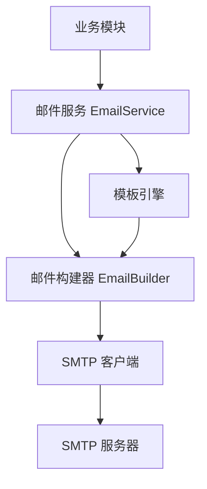

# 邮件发送服务 技术设计文档

> 作者：[待填写]
> 日期：2026-02-27
> 状态：草稿

---

## 1. 背景

### 1.1 问题描述

当前系统缺少邮件通知能力，无法向用户发送注册验证、密码重置等通知邮件，也无法定期发送业务报表。这导致用户体验受限，业务流程中的关键信息无法及时传达。

### 1.2 目标

- 实现基础邮件发送能力，支持文本和 HTML 格式
- 支持邮件附件功能（用于发送报表文件）
- 邮件发送成功率 > 95%
- 单封邮件发送响应时间 < 3 秒

---

## 2. 方案设计

### 2.1 整体架构



### 2.2 核心流程

1. 业务模块调用 `EmailService.send()` 方法
2. 邮件服务根据参数构建邮件对象（主题、正文、附件等）
3. 如果使用 HTML 模板，通过模板引擎渲染内容
4. SMTP 客户端建立连接并发送邮件
5. 返回发送结果（成功/失败及原因）

### 2.3 技术选型

| 组件 | 选择 | 理由 |
|------|------|------|
| 邮件发送 | Python `smtplib` + `email` | Python 标准库，无需额外依赖，满足基本需求 |
| HTML 模板 | Jinja2 | FastAPI/Django 生态常用，功能强大 |
| 附件处理 | `email.mime` | 标准库支持，处理 MIME 类型可靠 |

---

## 3. 接口定义

### 3.1 API 接口

**发送邮件**

- 路径：`POST /api/v1/email/send`
- 描述：发送邮件到指定收件人

请求参数：
```json
{
  "to": ["user@example.com"],
  "cc": ["cc@example.com"],
  "subject": "string, 必填, 邮件主题",
  "content": "string, 必填, 邮件正文（纯文本）",
  "html_content": "string, 可选, HTML 格式正文",
  "template_name": "string, 可选, 模板名称",
  "template_data": "object, 可选, 模板变量",
  "attachments": [
    {
      "filename": "report.pdf",
      "content_base64": "base64编码的文件内容",
      "content_type": "application/pdf"
    }
  ]
}
```

响应：
```json
{
  "code": 0,
  "message": "success",
  "data": {
    "message_id": "xxx-xxx-xxx",
    "sent_at": "2026-02-27T10:00:00Z"
  }
}
```

错误码：
| 错误码 | 说明 |
|--------|------|
| 4001 | 收件人地址无效 |
| 4002 | 邮件主题不能为空 |
| 4003 | 附件大小超过限制 |
| 5001 | SMTP 连接失败 |
| 5002 | 邮件发送失败 |

### 3.2 核心类设计

```python
class EmailConfig:
    """SMTP 配置"""
    smtp_host: str
    smtp_port: int
    smtp_user: str
    smtp_password: str
    use_tls: bool = True
    sender_email: str
    sender_name: str

class EmailMessage:
    """邮件消息"""
    to: List[str]
    cc: List[str] = []
    bcc: List[str] = []
    subject: str
    content: str
    html_content: Optional[str] = None
    attachments: List[Attachment] = []

class Attachment:
    """邮件附件"""
    filename: str
    content: bytes
    content_type: str

class EmailService:
    """邮件发送服务"""
    def send(self, message: EmailMessage) -> SendResult
    def send_template(self, template_name: str, data: dict, message: EmailMessage) -> SendResult
```

---

## 4. 实现计划

### 4.1 里程碑

| 阶段 | 目标 | 预计时间 |
|------|------|----------|
| M1 | 基础邮件发送（文本 + HTML） | 1 天 |
| M2 | 附件功能 + API 接口 | 1 天 |
| M3 | 模板引擎集成 | 0.5 天 |
| M4 | 测试与文档 | 0.5 天 |

### 4.2 详细任务

| 任务 | 预计时间 | 依赖 |
|------|----------|------|
| 实现 EmailConfig 配置类 | 1h | - |
| 实现 EmailMessage 数据类 | 1h | - |
| 实现 SMTP 发送核心逻辑 | 3h | 配置类 |
| 实现附件处理 | 2h | 核心逻辑 |
| 实现 HTML 模板渲染 | 2h | - |
| 编写 API 接口 | 2h | 核心逻辑 |
| 编写单元测试 | 2h | 全部功能 |
| 编写使用文档 | 1h | 全部功能 |

---

## 5. 风险与依赖

| 风险/依赖 | 影响 | 应对措施 |
|-----------|------|----------|
| SMTP 服务器配置错误 | 邮件发送失败 | 启动时验证配置，提供配置检查接口 |
| 邮件被识别为垃圾邮件 | 送达率降低 | 配置 SPF/DKIM，使用企业邮箱域名 |
| 附件过大导致超时 | 请求失败 | 限制附件大小（建议 10MB），给出明确提示 |
| SMTP 服务器不稳定 | 发送失败 | 实现简单重试机制（最多 3 次） |

---

## 附录

### A. 配置示例

```python
# config.py
EMAIL_CONFIG = {
    "smtp_host": "smtp.example.com",
    "smtp_port": 587,
    "smtp_user": "noreply@example.com",
    "smtp_password": "${EMAIL_PASSWORD}",  # 从环境变量读取
    "use_tls": True,
    "sender_email": "noreply@example.com",
    "sender_name": "系统通知"
}
```

### B. 使用示例

```python
from email_service import EmailService, EmailMessage, Attachment

service = EmailService()

# 发送简单邮件
message = EmailMessage(
    to=["user@example.com"],
    subject="欢迎注册",
    content="感谢您的注册！",
    html_content="<h1>感谢您的注册！</h1>"
)
result = service.send(message)

# 发送带附件的邮件
attachment = Attachment(
    filename="report.pdf",
    content=open("report.pdf", "rb").read(),
    content_type="application/pdf"
)
message = EmailMessage(
    to=["manager@example.com"],
    subject="月度报表",
    content="请查收附件中的月度报表。",
    attachments=[attachment]
)
result = service.send(message)
```
